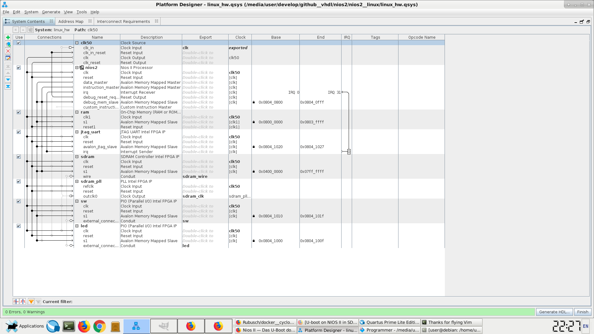

# Build Container for my linux on NIOS2 (softcore on Altera/Intel's DE1-SoC Board)

Nios II is a 32-bit embedded-processor architecture designed specifically for the Altera family of FPGAs. A Dockerfile for building a docker image for the Software and BSP using buildroot.  

The image uses the code sourcery toolchain (build up by buildroot or in comments downloaded from mentor graphics directly), the toolchain is 32bit thus needs libc6 32bit support.  



## Build

```
$ cd ./docker__buildroot

$ time docker build --build-arg USER=$USER -t rubuschl/nios2-buildroot:$(date +%Y%m%d%H%M%S) .
    10m...
```

Use ```--no-cache``` to re-build the base docker image.


## Usage

```
$ docker images
    REPOSITORY                  TAG                 IMAGE ID            CREATED             SIZE
    rubuschl/nios2-buildroot 20191104161353      cbf4cb380168        24 minutes ago      10.5GB
    ubuntu                      xenial              5f2bf26e3524        4 days ago          123MB

$ time docker run --rm -ti --user=$USER:$USER --workdir=/home/$USER -v $PWD/configs:/home/$USER/configs -v $PWD/dl:/home/$USER/buildroot/dl -v $PWD/output:/home/$USER/buildroot/output rubuschl/nios2-buildroot:20191104161353
```

## Debug

```
$ docker images
    REPOSITORY                  TAG                 IMAGE ID            CREATED             SIZE
    rubuschl/nios2-buildroot 20191104161353      cbf4cb380168        24 minutes ago      10.5GB
    ubuntu                      xenial              5f2bf26e3524        4 days ago          123MB

$ docker run --rm -ti --user=$USER:$USER --workdir=/home/$USER -v $PWD/configs:/home/$USER/configs -v $PWD/dl:/home/$USER/buildroot/dl -v $PWD/output:/home/$USER/buildroot/output rubuschl/nios2-buildroot:20191104161353 /bin/bash
```


## Image

### Login

u: root  
p: N/A  


### DTS

Generate the ``sopc2dts.jar`` file  

```
$ git clone https://github.com/wgoossens/sopc2dts.git
$ cd sopc2dts
$ make
```

Copy .jar file   

```
$ cd ..
$ cp ./sopc2dts/sopc2dts.jar .
```

Generate .dts file  

```
$ java -jar ./sopc2dts.jar --force-altr -i ./linux_hw.sopcinfo -o linux_hw.dts
```


## Hardware

### Flash the NIOS 2 System to the target

Flash logic design from quartus to the board, connect via USB blaster II. Generate the .cdf file. Easiest is via graphical Programmer in Quartus, once the *C*hain *D*escription *F*ile was saved, then _quartus_pgm_ can use it from off the shell.  

```
$ cd <path to quartus project>
$ $ quartus_pgm -c 1 ./output_files/linux_hw.cdf
```

alternatively via .sof (*S*RAM *O*bject *F*ile)   

```
$ quartus_pgm --debug  -m jtag -c 1 -o "p;./output_files/linux_hw.sof@2"
```

Where ``-o <options>;<input_file>@<device_index`` is to be applied, i.e. FPGA is of index 2 on my DE1 SoC board, so I take ``@2``.  


## Software

### Toolchain

Enter the docker container as above mentioned ``docker run``, then execute  

```
$ cd ~/buildroot

$ cp ~/configs/lothars__buildroot__nios2_defconfig ./configs/

$ make lothars__buildroot__nios2_defconfig

$ make sdk

$ cd ./output/images/

$ ls -l
    total 198288
    -rw-r--r-- 1 user user 114957893 Sep 19 20:51 nios2-buildroot-linux-gnu_sdk-buildroot.tar.gz
    -rw-r--r-- 1 user user   5888512 Sep 19 20:50 rootfs.cpio
    -rw-r--r-- 1 user user   5888576 Sep 19 20:50 rootfs.cpio.uboot
    -rw-r--r-- 1 user user   2985832 Sep 19 20:50 rootfs.jffs2
    -rw-r--r-- 1 user user   6461440 Sep 19 20:50 rootfs.tar
    -rw-r--r-- 1 user user    274306 Sep  8 20:00 u-boot.bin
    -rw-r--r-- 1 user user  66583552 Sep  6 23:55 vmlinux

$ tar xzf nios2-buildroot-linux-gnu_sdk-buildroot.tar.gz
```

Source environment and prepare the following:  

```
$ export PATH=$PATH:/home/$(whoami)/buildroot/output/images/nios2-buildroot-linux-gnu_sdk-buildroot/bin
$ export ARCH=nios2
$ export CROSS_COMPILE=nios2-linux-gnu-

```

Now inside the docker container in case ``git clone`` the u-boot source in the output folder and compile with the sourced enviornment (above)  


### Build U-Boot

Best is to set up a docker container with the corresponding toolchain (Mentor Graphics Code Sourcery).   

Note: there are several releases, which only contain the SOURCE packages. As can be read in the .sh file (Linux) this is not for installation, but only for "understanding how Mentor Graphics builds toolchains". Some other Editions, also contain binary packages, which then can be installed on 32bit Linux or Linux with compatibility 32bit libc package installed. In general a better approach is to get buildroot, and build the BSP or SDK from there. Buildroot fetches and sets up the latest Code Sourcery Toolchain.   

Then go into the sources, e.g. cloned u-boot sources, adjust  
* ``./configs/my_nios2_defconfig`` (template e.g. ``10m50_devconfig``)  
* ``./include/configs/my_nios2.h`` (template e.g. ``10m50_devboard.h``)  
* ``./arch/nios2/dts/my_nios2.dts`` (generated from ``sopc2dts.jar`` as above, template ``10m50_devboard.dts``)  


configure serial path property to the chosen node, like this,  
    chosen {
        stdout-path = &uart_0;
    ;

using SPI/EPCS or I2C, in case sequence the interfaces by serial number  
    aliases {
        spi0 = &epcs_controller;
    };


### Flash U-Boot to the target

Now via the ``nios2-download`` and ``nios2-flash-programmer`` tools try to flash the images to the board.  

references:  

* https://rocketboards.org/foswiki/Documentation/NiosIILinuxUserManualForCycloneIII
* https://www.intel.com/content/dam/www/programmable/us/en/pdfs/literature/ug/niosii_generic_booting_methods.pdf
* https://www.intel.cn/content/dam/altera-www/global/zh_CN/pdfs/literature/an/an458.pdf

Using the Compact Flash Interface (CFI) TODO  

```
TODO
$ nios2-download -g -r u-boot.srec

$ nios2-terminal
TODO
```

EPCS boot
* set the MSEL to allow for AS (**A**ctive **S**erial)
* select EPCS component in QSYS
* In Quartus go to **Assignments** (menu), there select **Device..**. There is a button **Device and Pin Options..**. Under **Configuration** change configuration from _Passive Serial_ to one of the _Active Serial_ settings, in case also additionally change the _Configuration Device_ from _auto_ to _EPCS1_ or so

EPCS (by document)
```
$ bin2flash --input=u-boot --output=u-boot.flash --location=0x0060000

$ nios2-flash-programmer --base=0x0 --epcs u-boot.flash

$ nios2-download -r -g

$ nios2-terminal
```

EPCS boot, trying to convert u-boot to a u-boot.flash  
```
$ find /opt/intelFPGA/18.1std/ -name boot_loader_cfi.srec
    /opt/intelFPGA/18.1std/nios2eds/components/altera_nios2/boot_loader_cfi.srec
    /opt/intelFPGA/18.1std/ip/altera/nios2_ip/altera_nios2/boot_loader_cfi.srec

$ elf2flash --base=0x0 --epcs --end=0xc7FFFFFF --boot=/opt/intelFPGA/18.1std/ip/altera/nios2_ip/altera_nios2/boot_loader_cfi.srec --input=u-boot --output=u-boot.flash

FIXME:
in epcs mode, base address has to be 0x0!
$ elf2flash --base=0x0 --epcs --end=0xc7FFFFFF --verbose --boot=/opt/intelFPGA/18.1std/ip/altera/nios2_ip/altera_nios2/boot_loader_cfi.srec --debug --input=u-boot --output=u-boot.flash


## debug

$ elf2flash --base=0x0 --epcs --end=0xc7FFFFFF --verbose --boot=/opt/intelFPGA/18.1std/ip/altera/nios2_ip/altera_nios2/boot_loader_cfi.srec --debug --input=u-boot --output=u-boot.flash

$ nios2-download -g u-boot.flash && nios2-terminal -v
```


### Tricks

NB: Sometimes it helps to turn the board off and on again before flashing.   

